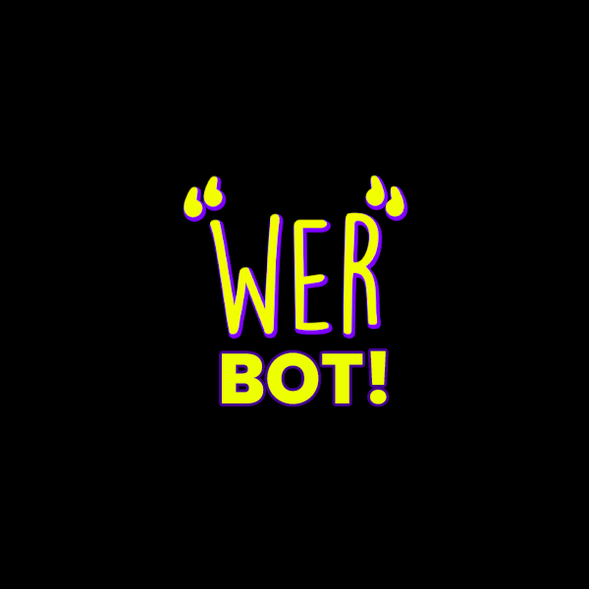

# WerBot


,




> Um bot "organizado", usando discord.py com suporte a slash commands e cogs facilitados.

### 🔧 Ajustes e melhorias

O projeto ainda está em desenvolvimento e as próximas atualizações serão voltadas nas seguintes tarefas:

- [x] Mecanismo de browse para cogs simples
- [x] Implementação dos slash commands
- [x] Uso de algumas API's exemplificativas
- [x] Implementar database
- [x] Implementar cogs de musica
- [ ] Implementar cogs de economia
- [x] Implementar cogs de giveaway

## 💻 Pré-requisitos

Antes de começar, verifique se você atendeu aos seguintes requisitos:

- `Python 3.10+, que pode ser baixado em:` <https://www.python.org/downloads/>
- `Ter um token de bot do discord, que pode ser obtido em:` <https://discord.com/developers/>
- `Ler` <https://nextcord.readthedocs.io/en/stable/>.

## 🚀 Instalando

Para instalar siga estas etapas:

Windows:

```
° nextcord
°aiosqlite
°humanfriendly
°requests
°datetime
°asyncio
°nextwave
°typing
°python-dotenv
° Clonar o repositório e ser feliz.

```

## ☕ Usando

Para usar, siga estas etapas:

```
- [1] Crie um arquivo chamado config.py e siga as intruções no arquivo configexample.py
- [2] Crie uma database sqlite chamado main.db
- [3] Siga os comentários no main.py para mais informações de uso.
```

## 🤝 Pessoas que ajudaram MUITO S2

Eu preciso agradecer a alguns amigos que me ajudaram a fazer isso funcionar bem:

<table>
  <tr>
    <td align="center">
      <a href="#">
        <br>
        <sub>
          <b>GabriWar</b>
        </sub>
      </a>
    </td>
    <td align="center">
      <a href="#">
        <br>
        <sub>
          <b>Dasma Tech</b>
        </sub>
      </a>
    </td>
  </tr>
</table>

## 📝 Licença

Esse projeto está sob licença. Veja o arquivo [LICENÇA](LICENSE.md) para mais detalhes.
